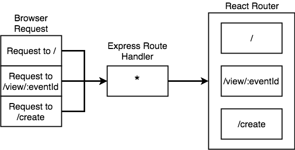
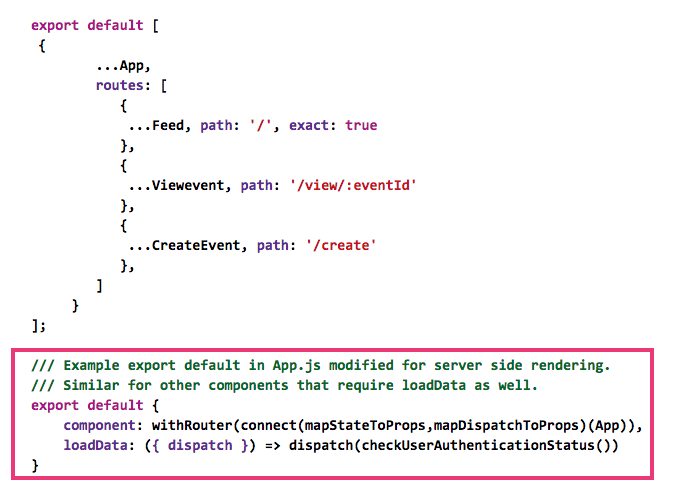
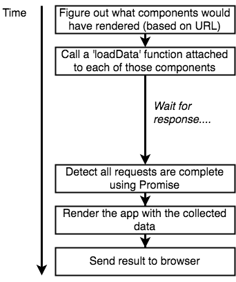
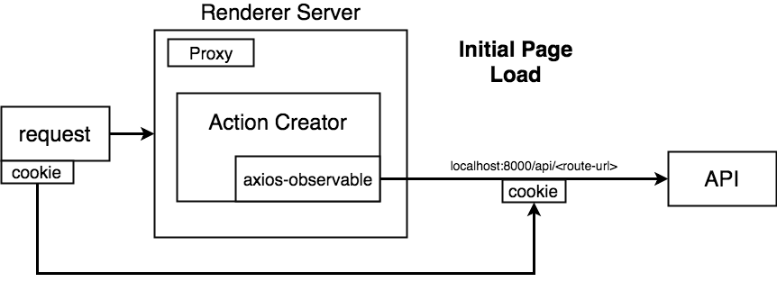
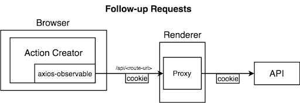

## CrowdAlert

**Important Links**
* Live demo: [https://crowdalert.herokuapp.com](https://crowdalert.herokuapp.com)
* Project: [https://gitlab.com/aossie/CrowdAlert-Web](https://gitlab.com/aossie/CrowdAlert-Web)
* Organisation: [AOSSIE - Australian Open Source Software Innovation and Education](https://summerofcode.withgoogle.com/organizations/4765796773920768/)

CrowdAlert, designed to be a trustworthy crowdsourced information channel, focuses on delivering the right information to the right people on time. It provides a global platform where users are able to view incidents nearby. Whenever a user reports an incident, CrowdAlert does the heavy lifting of notifying the nearby people. It practically addresses a really good idea we are trying to build a solution for. It addresses a real-life problem that I really feel is worth solving. The market competition is not tough for this idea with our technology to succeed. I have been reading various articles about this idea on the internet. As far as I have learnt, all the competitors out there technologically lag behind. If it scales well, it will really be a great help to people from all over the world eventually.

**_Nearby incident awareness platform for everyone_** - is what I believe is the vision for Crowd Alert.

### Goals

CrowdAlert was conceived and idealized by Bruno Woltzenlogel Paleo in 2017 and was initially developed as a mobile app by Siddartha Sekhar Padhi as a part of GSoC 2017. Then in GSoC 2018, Joydeep Mukherjee extended the idea to develop a full-fledged web app.

This year, the goal was to add core optimisations and new features to the user experience of the React-Django application. That implies, using Server-side Rendering for faster page loading times (significantly low Time To First Byte), using web-sockets for real-time updates for incidents, comments and HTTP Long Polling for upvotes etc., migrating to a better database, finally, decoupling it from Django views. Then write consistent tests to validate different models, APIs, components, reducers and actions. Finally, hosting an NFSW image classifier. Eventually, we will end up with cleaner code, sound application architecture of both frontend and backend, adding more tests and developing/revamping new features are the most obvious ones. This will not only make developing new features much more easier, cleaner and maintainable but will also dramatically improve user experience.

### Previous Contributions
 
### CHANGELOG (August 19, 2019)

The changes can be summarized as follows:
 
1. CrowdAlert-Web now uses Server-side rendering on top of React-Redux web application. The advantages of using Server-side rendering in our case can be summarized as follows:
   * The application’s performance depends on server’s resources and the user’s network speed which makes it very useful for content heavy sites.
   * Most of the search engine crawlers do not yet understand JavaScript. So, it inevitably becomes important to pre-render meta tags before sender the initial HTML to the user. Thanks to Server-side rendering.
2. CrowdAlert-Web’s old database has been migrated to Firebase Firestore opening doors for more powerful queries. A significant time has been spent on designing model classes using the object-oriented approach. This not only resulted in improved performance of geo-spatial queries but also refactor of Django API view classes for the better.
3. CrowdAlert-Web now supports real-time communication for its incidents and comments component. This decreases latencies as compared to HTTP requests and improves user experience.
4. Finalized the continuous integration/continuous deployment process to Heroku.
5. Added frontend (React-Redux) and backend (Django) unit and integration tests which will evaluate the code during CI/CD process.
6. CrowdAlert-Web now has following end user features:
   * Added support for Google Maps direction.
   * User can now edit incidents directly from main incident's page.
   * Added “Settings” page​.
   * New UI for email verification page. New designs for [mobile](https://gitlab.com/aossie/CrowdAlert-Web/uploads/955d115d64408998c636cdc612f09891/Screen_Shot_2019-03-15_at_1.34.23_AM.png) and [web](https://gitlab.com/aossie/CrowdAlert-Web/uploads/5dde16aac7941ee257783c64671287ca/Screen_Shot_2019-03-15_at_1.34.35_AM.png).​
   * Added an option to set the home location.
   * Nearby incidents will now be cached using PouchDB for faster load times.
   * Added location validation while editing an incident.
   * Added “Profile” page for updating name and profile image.
   * CrowdAlert-web now uses a hosted Not Safe for Work (NSFW) image classifier to classify incident images uploaded by the user.
 
### Technical Overview
Front end is written using React/NodeJS and backend using Django. Some of the core technologies/platforms are listed below:
- [Node JS v10.15.1 LTS](https://nodejs.org/ja/blog/release/v10.15.1/) - Basis for development, packaging and deployment tools.
- [React](https://reactjs.org/), [Redux](https://redux.js.org/) - JavaScript framework and state management tool for the frontend
- [Jest](https://jestjs.io/), [Enzyme](https://airbnb.io/enzyme/) - Testing framework for React and Redux
- [Semantic UI React](https://react.semantic-ui.com/) - React based CSS framework
- [Google Firebase Platform](firebase.google.com) - Used for user authentication, database and hosting
- [Django](https://www.djangoproject.com/) - Used for developing ReST APIs and web socket APIs
 
During the first phase of GSoC I implemented server-side rendering. This task was divided into following parts:

- **Initial setup and Routing:** This part included writing webpack configuration for server and client code base, server renderer, implementing React router support.

- **Setting up Redux and server side data fetching:** This part included managing separate store for client and server; Exporting a promise returning function from components mounted on various routes.

- **Setting up proxy and user authentication:** Setting up proxy for the backend server through the render server; Setting up token based user authentication on render server. T
 
- **Finalizing server-side rendering and SEO:** Most of the server-side rendering part has been done. Only remaining part is bug fixing and adding component based dynamic `<meta />` tags. This is handled using React-Helmet.
 
The first phase was entirely focussed on server-side rendering. The deployment part was quite interesting. Since, Heroku limits application purge size to 500MB for a single dyno except when you containerize your application. So, in order to avoid any overhead costs, I used docker to containerize both frontend and backend into same image only exposing frontend's host and port to public.

During the second phase, I implemented web sockets using python’s channels package; Using webSocket connection for signed-in users only for getting events and comments in real-time. For handling messaging queues and groups, I used channel’s in-memory layer instead of redis. For fetching upvote counts incidents and comments, I used HTTP long polling. Then, I spent time designing the Firestore database schemas for every Django app and finally implemented that schema which included refactoring Django views to use new model classes.

During the final phase, I spent time on writing unit test for each and every component, reducer and action. And for the backend, wrote tests for every model, its methods, and views. Then, since I already had raised a merge request for adding continuous integration, I used it to add new test scripts on top.
Then, I spent time on developing new features as described in CHANGELOG section point 6.

### Detailed Description
#### Abstract

##### Drawbacks of Existing Application Stack
CrowdAlert-Web currently uses React-Redux application as its frontend, Django as its backend and Firebase Realtime Database. For the frontend, React with redux scales very well from small applications to really heavy applications and it does not require many changes for it to work with our use case. But the bottlenecks for such content heavy applications are its size and of course SEO (for which you will have to write a lot of code to dynamically add `<meta />` tags for each page in a client-side rendered application, which it is currently). While in server-side rendering, the application's performance depends on the server's resources and the user's network speed. This makes it very useful for content-heavy sites. For example, say that you have a phone with slow internet speed. You try to access a site that downloads 4MB of data before you can see anything. You wouldn't be able to see anything on your screen within 2-4 seconds. That's a really really important problem to solve by SSR. Search engine crawlers do not yet understand/render JavaScript. So for the React application, it is impossible to deliver results relevant to the search query made by the user.


As you can see, the above image shows Google search console. Google crawler renders nothing for the React application.

Firebase Realtime Database is not the right database to use as it has a lot of issues in terms of implementation, query capabilities and scalability. Since it is a simple tree of JSON key-value pair:

1. Every time you fetch a node, all of its nested children come along wasting the bandwidth.
2. Is not scalable and you will have to manually create master and slaves shards sooner which is a problem.
3. It only supports nesting up to 32 child nodes.
4. No extended support for complex queries (including geospatial queries). 

Firebase Firestore is an alternative offering much better scalability, efficient reads and writes if we are sticking to Firebase as it offers free hosting.

Apart from these, there are some really important Features that are absolutely required to be implemented because they make so much real life sense. They include broadcasting a new event/incident to all the authenticated clients, realtime comment feature, and using HTTP long polling for sending updates. These problems can be solved by using Django Channels, replacing WSGI by ASGI.

##### Goals

The First part of this proposal is about refactoring the current React application for server-side rendering. Then, writing web sockets for replacing a few backend ReST APIs that cover all the proposed use cases for implementing web sockets.

Apart from migrating our existing database to Firebase Firestore, we need to decouple it from our existing API logic in views.py. This will result in cleaner, more maintainable code and will help us switch to any better database solution efficiently later on. Then we need a consistent code to validate different models and fields based on business use cases. Then, we need to write more tests and rewrite existing ones. We will not break backward compatibility.
I have already raised a merge request (!45) for CI/CD pipeline so, a few more commits will be required to finalize and merge it into master.
Then I will resume my work on new features (see #13 and link to my new feature merge request).

In the end, I'll finish off by writing the developer documentation and describing the future prospects of this project.

##### Benefits

There are lots of benefits. Clean code, sound application architecture of both frontend and backend, adding more tests and developing/revamping new features are the most obvious ones. It will significantly reduce Time To First Byte (TTFB), which is, by the way, an important parameter for better SEO.

#### Server-side Rendering

I want to talk a little bit about server-side rendering as it will be the most complex and anticipated part of the application and this proposal as this is going to bring a dramatic change in application’s first-time user experience and SEO. 

If we want to implement server side rendering, we should do it as soon as possible because later on it becomes really hard to do as the complexity of our application increases.

##### OVERVIEW

I will start off by creating routes for the application using nodejs express framework. We're going to delegate all of the routes in express to React router. As an example -



For the following routing configuration -



React router is going to use this configuration to build the required React components and redux store given the path. Easy.

In order for nodeJs to understand JSX on server and JavaScript on the browser, we need to bundle, then babelify (transpile) all our code and run the client's bundle.js in the browser so that the React application can boot up. Finally, using `react-dom/server` for rendering JSX to string. This is the HTML that renders on the client's browser, the first thing before client's bundle.js boots up and [hydrates](https://reactjs.org/docs/react-dom.html#hydrate) the React application in the browser.

##### HANDLING REDUX AND DATA FETCHING FROM API SERVER


There will be two redux stores, as usual, one for the client and one for the server with initialState defined by default. Also, we need to detect all initial data loading actions on the server so that we can attempt to render the app to a string and send it back to the user.



For every component that has an initial data requirement, it will have a `loadData` function that takes redux store as an argument. It will dispatch the required set of actions as `store.dispatch(fetchEventDetails())` (for example) and return a promise. As soon as all such promises from each of the components that are to be rendered on a specific route are fulfilled, we are going to use our updated redux store and render the React application exactly once on the server and return the HTML string to the user.

##### HANDLING USER AND API AUTHENTICATION

I will replace `ajax-observable` by `axios-observable` because axios allows creation of Axios instances, which can be initialised with different configurations. As in our case, we need to initialise Axios differently when the API server is called from the browser than it is called from the server.



Render server needs an auth token from browser to fetch the initial data from the API server if the user is logged in. To do that, we will use a proxy to our API server routed at `/api` endpoint and direct all backend APIs via this proxy. By using cookie-based authentication for the initial GET request that the browser makes to the render server, we will be able to identify and obtain the required auth token if the user is logged in and authenticate the render server to our API server.



As the backend API requests will be handled by a proxy running on our render server, when after the initial page loading, browser requests for some data on our backend server, we will simply forward those requests to our backend server. But we will attach the auth token from cookie to token header as usual.

#### WebSockets & HTTP Long Polling

WebSockets can be implemented in Django using python’s channels package. We can also setup HTTP long polling with channels as well. Using webSocket connection for -
1. For signed-in clients only for getting events and comments in real-time.
2. For upvotes, we will use long polling.

For handling messaging queues and groups, we will use channel’s in-memory layer for persistence. This is a built in persistence specification available via `channels.layers.InMemoryChannelLayer`.

**Here’s how grouping will work for Events Consumer** - Store the current user channel in a group whose name is formatted as `lat=<lat in query>&long=<lng in query>&dist=<dist in query>`. When a new event is added, iterate over all the groups. One by one parse their group names and compare whether the newly added event is in the vicinity of that group. If it is, send the newly added event to all the clients of that group. Continue otherwise.

**Here’s how grouping will work for Comments Consumer** - Store the current user channel in a group whose name is formatted as `<IncidentId>`. When a new comment is added, iterate over all the groups. One by one check the group names and compare whether the newly added comment’s IncidentId equals that of that group. If it is, send the newly added comment to all the clients of that group. Continue otherwise.

New Dependencies - `channels==2.1.7`

On the client, I will use native WebSocket browser APIs available to us. So a single socket connection will be used to **dispatch actions** with the required arguments. Then, inside `socket.onmessage`, dispatch the corresponding action.

#### NSFW Image Classifier

I will implement NSFW image classifier using existing Yahoo’s Open NSFW image classifier model. Since it is written Python 2.X, I will use code from **open_nsfw--** repository instead. It fully supports Python 3.X. This model will be exposed as a `aiohttp` web app’s HTTPS endpoint where user can POST an image URL and get the corresponding probability. The deployment of Heroku will be as a containerised application. On Heroku, while Docker images are not subject to size restrictions (unlike slugs/applications deployed via Procfile), they are subject to the dyno boot time restriction. As layer count/image size grows, so will dyno boot time.

Before implementing the classifier, I need to make sure that the image that is present at the end point has the type `image/<type=one of png/jpg/jpeg/svg/webp>` and not `application/octet-stream`. To do this save **pyrebase.py** to local util directory and add a new method in `Storage`` class named update(self, file=None, metadata=None, token=None)` which does the following -
* Optionally updates the image at remote url.
* Optionally updates metadata(for now only contentType) of the file at remote url.

Then,

* In order to encapsulate classification feature within Image model, I need to add a @asyncfunc decorated method inside Image model that makes a request to the classifier server and returns the NSFW score of the provided image.
* In a nutshell, the function will look like this -
```python
import requests
r = requests.post(NSFW_CLASSIFIER_ENDPOINT, data={"url": "https://firebasestorage.googleapis.com/v0/b/path/to/file.jpg?alt=media"})
nsfw_prob = float(r.text)
```
Then,  update the NSFW status of the respective Image on Firestore.


### Merge Requests
 
1. [Merge Request !1](https://gitlab.com/aossie/CrowdAlert-Web/merge_requests/59): Initial setup and routing, *Status: **merged***
    * Webpack config
	* Babel config
	* npm scripts
	* New ssr dependencies
	* Added entry point file for server
	* Refactor src/ into client/ and `index.js`
	* Setting up the renderer that binds ES6 stringified HTML with server side JSX and returns it
	* Setting up build configuration for client and server-side bundle.js
	* Implement React Router support and bind with it express Route configuration
	* Restructuring the webpack and npm scripts for cleaner code

2. [Merge Request !2](https://gitlab.com/aossie/CrowdAlert-Web/merge_requests/60): Redux and server-side data fetching, *Status: **merged***
	* Create separate stores for the browser and the server
	* Exporting `loadData` function along with the components that returns a promise
	* Creating a `Promise.all` to get notified when all of the data fetching

3. [Merge Request !3](https://gitlab.com/aossie/CrowdAlert-Web/merge_requests/61): Proxy and user authentication, *Status: **merged***
	* Refactor code to redirect all `/api` routes
	* Create server side and client side axios instances with thunk
	* Setup configuration with express to proxy all `/api` routes made on the client side
	* Refactor authentication based rendering in App.js for more generalized `RequireAuth` based components
	* Setting up a context in​ StaticRouter​ to setup not-found route and send a 404 to the browser
	* Replace `window.localStorage` by cookies as required by auth
	* Handing Auth components using **Firebase Auth Rest API** on server

4. [Merge Request !4](https://gitlab.com/aossie/CrowdAlert-Web/merge_requests/62): Finalizing Server side rendering and SEO, *Status: **merged***
	* Handling errors when one or some `loadData` promise(s) rejects
	* React Helmet setup
	* Statically render SEO tags
	* Final cleanup and prepare remote deployment

5. [Merge Request !5](https://gitlab.com/aossie/CrowdAlert-Web/merge_requests/63): WebSockets - Setting up In Memory persistence layer and consume web socket connections, *Status: **merged***
	* Declare a backend channel layer with in-memory persistence specification
	* Writing Events consumer
	* Writing Comments consumer
	* Create routing.py, the file that contains web socket routing information
	* On frontend, setup socket connects in a new directory socket/index.js that takes `store.dispatch`
6. [Merge Request !6](https://gitlab.com/aossie/CrowdAlert-Web/merge_requests/64): Long polling, *Status: **merged***
	* Writing Upvotes long polling consumer
7. [Merge Request !7](https://gitlab.com/aossie/CrowdAlert-Web/merge_requests/65): Create model classes and migrate to firestore, *Status: **merged***
	* Create new models for Firebase Firestore: Comment model, CommentThread model, IncidentReport model, Incident model, User model, Upvotes model, Image model and Classifier model
	* Add data fetching logic encapsulated in those models
	* Cleanup up existing Firebase Database APIs from all of views.py
	* Migrate current Firebase Database APIs in views.py to new Model-based Firestore APIs
8. [Merge Request !8](https://gitlab.com/aossie/CrowdAlert-Web/merge_requests/66): Geohash implementation, *Status: **merged***
	* Port GeoFire functions in python for efficient geohash queries on Firestore
	* Using Haversine formula on significantly less incidents to calculate the distance
9. [Merge Request !9](https://gitlab.com/aossie/CrowdAlert-Web/merge_requests/67): Unit & Integration Testing, *Status: **merged***
	* Testing components (445)
	* Testing actions (102)
	* Testing reducers (70)
	* Testing APIs and Models (57)
10. [Merge Request !10](https://gitlab.com/aossie/CrowdAlert-Web/merge_requests/68): CI/CD Pipeline, *Status: **merged***
	* Add new tests for backend and data models
	* Bug fixing and patching whilst making sure that the pipeline succeeds
11. [Merge Request !11](https://gitlab.com/aossie/CrowdAlert-Web/merge_requests/69): Developing new features, *Status: **merged***
	* Finalizing support for Google Maps direction and add new tests
	* Allow edits from view incidents page
	* Add settings page features
	* New UI for email verification page. New designs for [mobile](https://gitlab.com/aossie/CrowdAlert-Web/uploads/955d115d64408998c636cdc612f09891/Screen_Shot_2019-03-15_at_1.34.23_AM.png) and [web](https://gitlab.com/aossie/CrowdAlert-Web/uploads/5dde16aac7941ee257783c64671287ca/Screen_Shot_2019-03-15_at_1.34.35_AM.png)
	* Support for an option to set the home location
	* Caching nearby events in the browser
	* Location validation while editing an incident
12. [Merge Request !12](https://gitlab.com/aossie/CrowdAlert-Web/merge_requests/70): Update Image Metadata & implement NSFW Image classifier, *Status: **merged***
	* Update put function in Storage class named `put(self, file, token=None, content_type=None)` in the new pyrebase.py
	* Add a `@asyncfunc` decorated method inside Image model that makes a request to the classifier server
	* Update the NSFW status of the respective Image on Firestore
13. [Merge Request !13](https://gitlab.com/aossie/CrowdAlert-Web/merge_requests/71): Writing documentation, bug fixing and describing the future scope of the project, *Status: **merged***
	* Documentation on how to setup the server side renderer and webpack server locally
	* Bug fixing
	* Describing the existing architecture of SSR so that it is easier to understand how it is implemented under the hood and therefore build new features upon it
	* Documenting Django APIs using Swagger
	* Describing the future prospects of this project
	* New user profile component to edit photo and name
	* Page for list of incidents reported by the user
	* Updated firestore rules

### Potential New Features
Below are some new features that CrowdAlert should have, grouped according to their prospective difficulties:

**Easy:**
* Add support for image upload from the view incidents page
* Remove WSGI dependency from Django backend
* Fallback to HTTP request if WebSocket is disconnected

**Medium:**
* Use Mapbox. Mapbox gives a free tier to work with unlike Google Maps. There are going to be several updates in the application:
	* Map component in the frontend
	* Feed
	* Reverse Geocoding endpoint
	* Events by location endpoint
	
	Use the `react-mapbox-gl` npm package developed by Uber for this purpose. See [this](https://gitlab.com/aossie/CrowdAlert-Web/issues/27) issue.

**Hard:**
* Use tf-serving for spam classifier
* Add a news aggregator to get latest news on reported incidents from various sources and display as a side column in Feed

### Conclusion
In conclusion, I would like to thank Joydeep Mukherjee, Siddartha Padhi, Thuvarakan Tharmarajasingam and Bruno Woltzenlogel Paleo for being so nice and helpful. I have learnt a lot in the past 3 months and it has been a great experience to be a part of this wonderful community.
